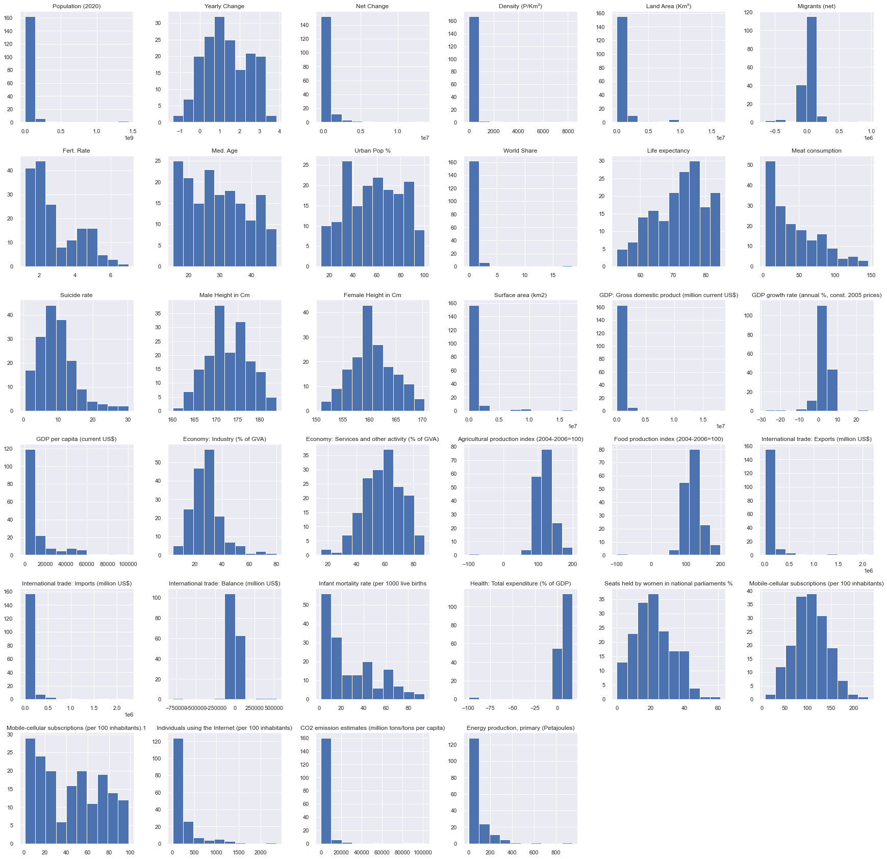

# World-Data-Project
Multiple Data Projects on world data statistics

This project was inspired by compiling multiple data sets from around the world for every country on earth.

The project uses two main data sets:
* [World o Meter](https://www.worldometers.info/world-population/population-by-country/)
* [Our World in Data](https://ourworldindata.org/)

