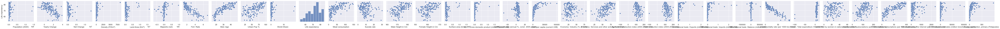
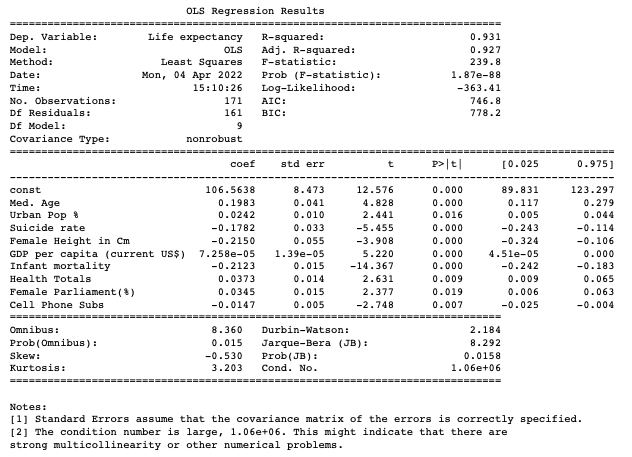
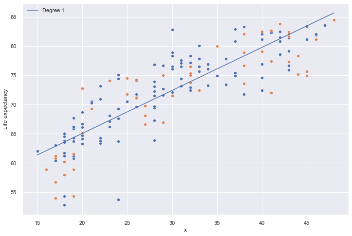
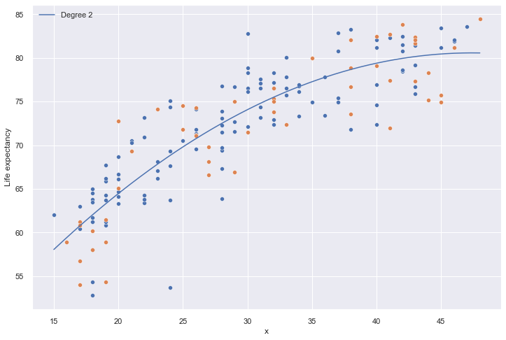
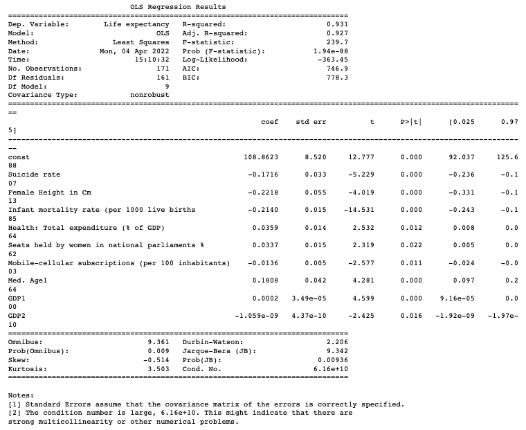
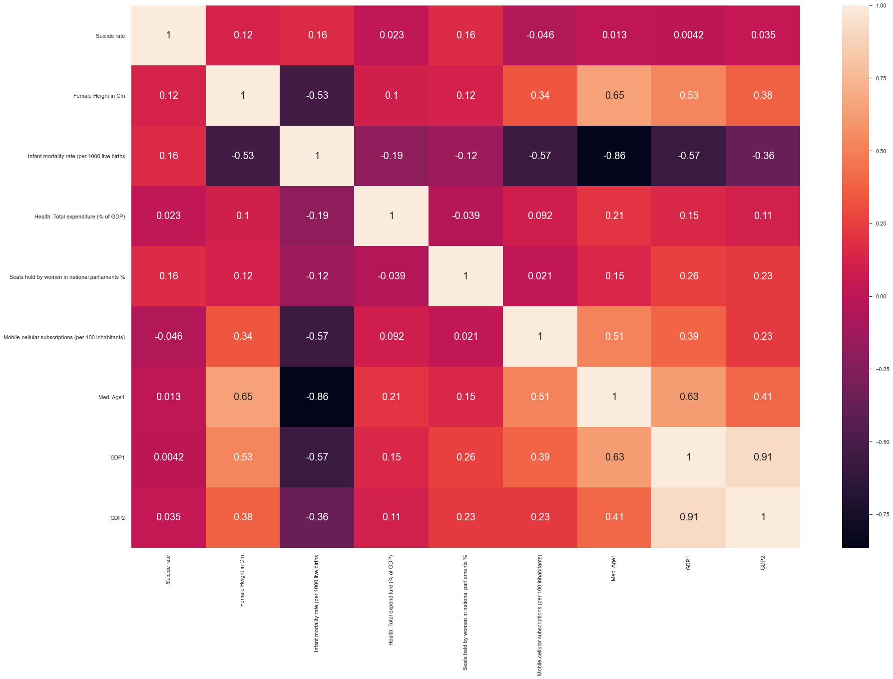
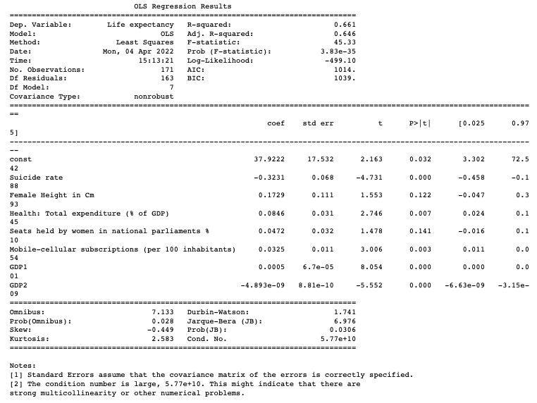
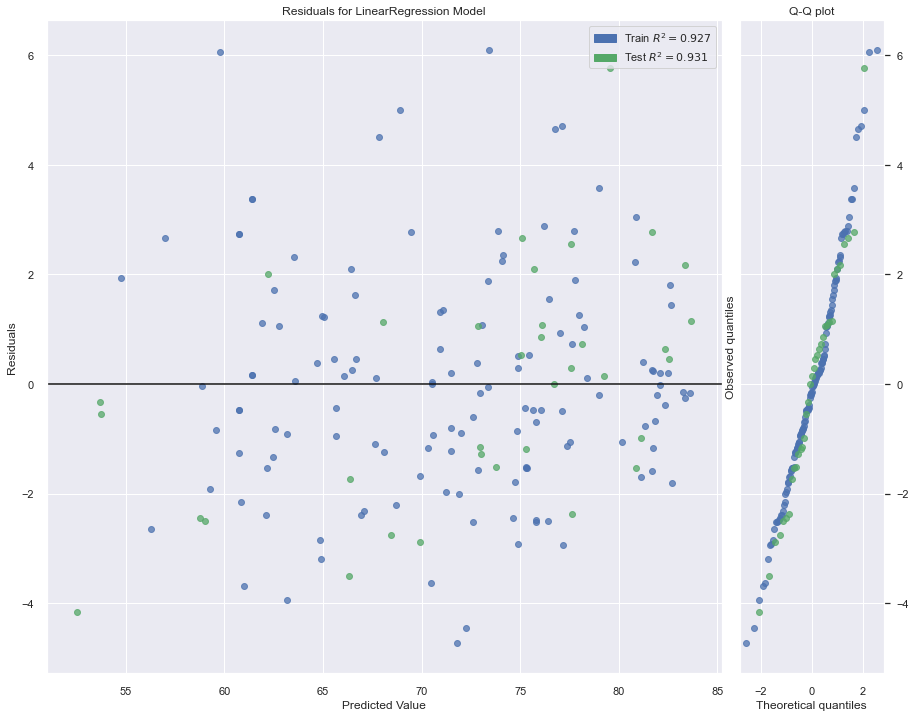
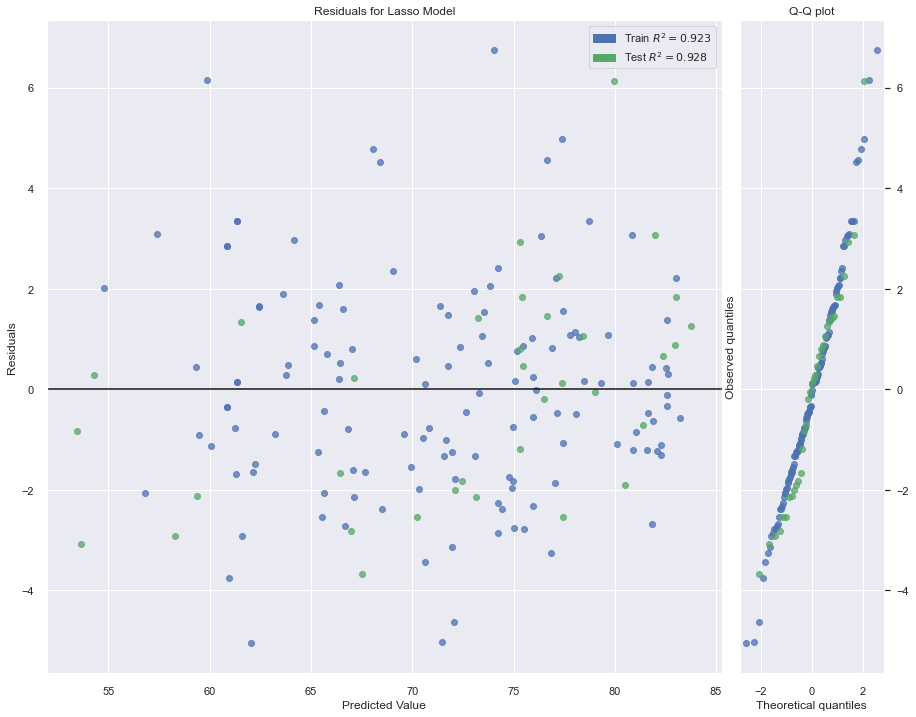
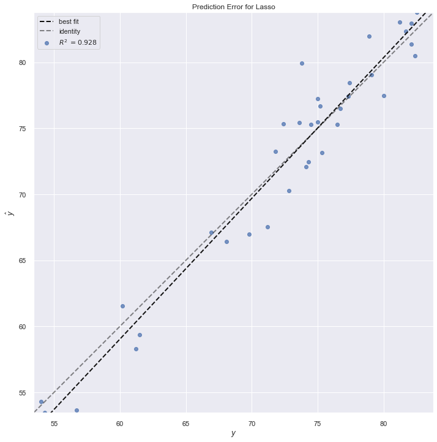

# World-Data-Project
Multiple Data Projects on world data statistics

This project was inspired by compiling multiple data sets from around the world for every country on earth.

# Regression - Infering relevant features related to Life Expectancy
The project uses two main data sets:
* [World o Meter](https://www.worldometers.info/world-population/population-by-country/)
* [Our World in Data](https://ourworldindata.org/)

## The first part of this project was a bit of exploratory data analysis:

First the histograms are plotted to get an understanding of the distributions of our features.
Next, each feature is plotted against the dependent variable, Life Expectancy, to see if there are any non-linear relationships observed.

Features with non-linear relationships with the dependent variable:
* Med. Age
* Meat Consumption
* GDP per capita

These features are explored for polynomial relationships.

## OLS - Ordinary Least Squares (Regression) 
First the OLS model is built using the original features (no polynomial feautures.
The model is run mulitiple iterations, each time setting a lower and lower threshhold for the p-value.

### The final model:

#### Take-aways:
* Total spend on healthcare as a percentage, percentage of population in urban areas, and percentage of females holding parliamentary seats all have a positive coefficient. This implies when they increase, the life expectancy of the population also increases.
* Median age and GDP per capita also have that effect on the model but are much harder to control directly with government agendas.

* Female height and Cell phone subscriptions per 100 individuals have negative coefficients. This implies that as they increase, the life expectancy of that society goes down.
* Suicide rate and infant mortality also have this effect.

## Polynomial Features:
The features identified above were used to apply Polynomial Features using sci-kit learn.

As is observed above, degree 2 polynomial fit the data much better and was thus incorporated into the model later down in the notebook.
### The final model after trimming high p-value features:

## Multicollinearity
Next multicollinearity was explored:

And a regression was applied after highly correlated independent variables were trimmed:

## Prediction

The last part was to see how the model would perform as a predictor using sci-kit learn. A train/test split was done, and then a regression was applied. The residuals were observed:

#### Regularisation
The last part was to apply regularisation techniques like lasso:

And then observe the prediction error:

